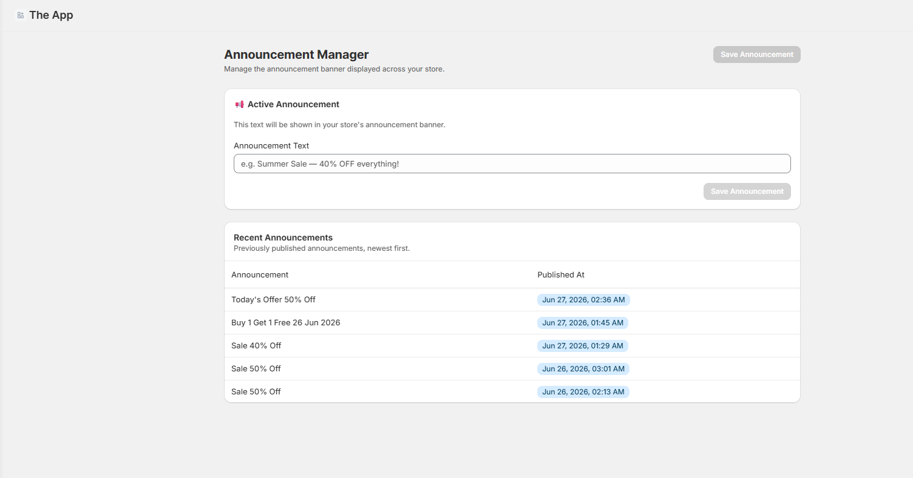

# 📢 Shopify Announcement Banner App

A production-ready **Shopify Embedded App** built using the **MERN Stack** that enables merchants to create and manage storefront announcement banners directly from the Shopify Admin.

The app stores every announcement in **MongoDB** for audit history, synchronizes the latest announcement to **Shopify Shop Metafields** using the **Shopify Admin GraphQL API**, and displays it across the storefront using a **Theme App Extension (App Embed Block)**.

---

# 🌐 Live Demo

**Production Deployment**

https://shopify-announcement-app-dwzz.onrender.com

> **Note:** This is a Shopify Embedded App. It should be opened from Shopify Admin or by entering a valid Shopify store domain on the login page.

---

# 📸 Screenshots

## Admin Dashboard



> You can also add more screenshots later.

```text
Screenshot/
├── Dashboard.png
├── Banner.png
├── MongoDB.png
└── Theme-Extension.png
```

---

# 🚀 Features

* Embedded Shopify Admin App
* Clean and responsive React + Polaris dashboard
* Create and manage storefront announcements
* Save announcement history in MongoDB
* Automatic timestamp for every announcement
* Synchronize announcements to Shopify Shop Metafields
* Display announcements using Theme App Extension
* Real-time storefront updates
* GraphQL Admin API integration
* Production deployment on Render

---

# 🏗️ System Architecture

```text
                 Shopify Admin

                        │

                        ▼

          React + Shopify Polaris UI

                        │

                        ▼

              Express API (Node.js)

             ┌──────────┴──────────┐

             ▼                     ▼

       MongoDB Atlas      Shopify Admin GraphQL API

 (Announcement History)      Shop Metafields

                                   │

                                   ▼

                       Theme App Extension

                          (App Embed Block)

                                   │

                                   ▼

                    Storefront Announcement Banner
```

---

# 🔄 Application Workflow

### Step 1

Merchant opens the embedded Shopify app.

↓

### Step 2

Merchant enters a new announcement.

Example

```
Summer Sale — 40% OFF
```

↓

### Step 3

Merchant clicks **Save Announcement**.

↓

### Step 4

The announcement is saved in MongoDB.

Example document

```json
{
  "text": "Summer Sale — 40% OFF",
  "createdAt": "2026-06-27T02:36:00Z"
}
```

↓

### Step 5

The latest announcement is synchronized to Shopify Shop Metafields.

Namespace

```
my_app
```

Key

```
announcement
```

↓

### Step 6

The Theme App Extension reads the Shop Metafield.

```liquid
{{ shop.metafields.my_app.announcement.value }}
```

↓

### Step 7

The latest announcement is displayed automatically on every storefront page.

---

# ⚙️ Tech Stack

## Frontend

* React
* Shopify Polaris
* React Router

## Backend

* Node.js
* Express.js

## Database

* MongoDB Atlas
* Mongoose

## Shopify Technologies

* Shopify App CLI
* Shopify Admin GraphQL API
* Shop Metafields
* Theme App Extension
* App Embed Block

## Deployment

* Render

---

# 📂 Project Structure

```text
the-app
│
├── app
│   ├── lib
│   │   └── mongodb.js
│   │
│   ├── models
│   │   └── Announcement.js
│   │
│   ├── routes
│   │   ├── app._index.jsx
│   │   └── api.announcement.jsx
│   │
│   └── shopify.server.js
│
├── extensions
│   └── announcement-banner
│       └── blocks
│           └── announcement-banner.liquid
│
├── prisma
├── public
├── Screenshot
├── package.json
└── README.md
```

---

# 🛠 Installation

## Clone the repository

```bash
git clone https://github.com/Shan-Ali4/shopify-announcement-app.git
```

```bash
cd shopify-announcement-app
```

---

## Install dependencies

```bash
npm install
```

---

## Configure Environment Variables

Create a `.env` file.

```env
MONGODB_URI=your_mongodb_connection_string

SHOPIFY_API_KEY=your_shopify_api_key

SHOPIFY_API_SECRET=your_shopify_api_secret

SHOPIFY_APP_URL=https://your-app-url

SCOPES=write_products,write_metaobjects,write_metaobject_definitions
```

---

## Start Development

```bash
npm run dev
```

---

# 🚀 Deployment

This project is deployed on **Render**.

Production URL

```
https://shopify-announcement-app-dwzz.onrender.com
```

---

# 🧪 Testing

After running the application:

### 1.

Open

```
Apps → The App
```

### 2.

Create a new announcement.

Example

```
Today's Offer — 50% OFF
```

### 3.

Verify

* Announcement saved in MongoDB
* Shop Metafield updated
* Storefront banner updated
* Announcement history visible in Admin Dashboard

---

# 📌 Shopify APIs Used

* Shopify Admin GraphQL API
* Shop Metafields API
* Theme App Extension
* App Embed Block

---

# ✅ Assignment Requirements Completed

* ✔ Shopify Embedded App
* ✔ React Admin Dashboard
* ✔ MongoDB Integration
* ✔ Announcement Audit History
* ✔ Shopify Admin GraphQL API
* ✔ Shop Metafields
* ✔ Theme App Extension
* ✔ App Embed Block
* ✔ Storefront Banner
* ✔ MERN Stack Architecture
* ✔ Render Deployment
* ✔ Public GitHub Repository

---

# 🎥 Demo Video

Add your Loom or YouTube demo video here.

```
https://your-demo-video-link
```

---

# 👨‍💻 Developed By

**Mirza Mohammad Shan Ali**

GitHub

https://github.com/Shan-Ali4

---

# 📄 License

This project was developed as part of a Shopify Developer Technical Assessment.
